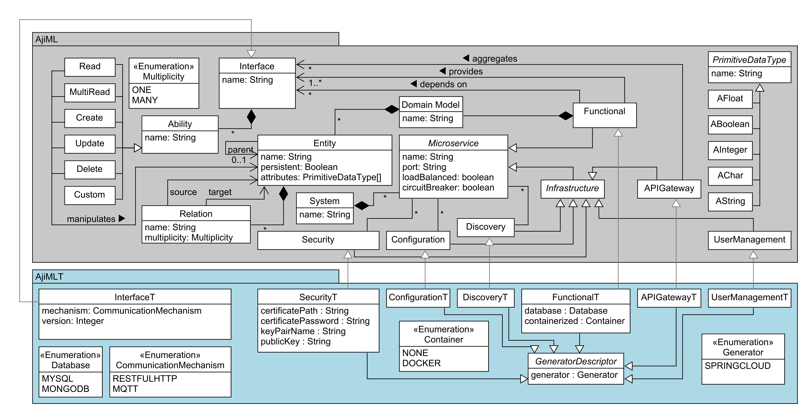

# AjiL
This repository is home of the Aji Modeling Language (AjiL). AjiL is a modeling language with associated tools to support the developement of Microservice Architecture (MSA). The language is mainly developed by the SEELAB research group of Dortmund's University of Applied Sciences and Arts. If you want to know more about Model-Driven Engineering (MDE) we recommend the book *Engineering Modeling Languages: Turning Domain Knowledge into Tools* by Combemale et al.

## The Modeling Language

As a modeling language, AjiL comprises three components: (i) Abstract syntax, (ii) Concrete syntax, and (iii) Semantics. Each component is described in the following sections. Although we eagerly work on improving the language itself as well as its documentation, we are still in an early developement stage. Please feel free to help improve AjiL.

### Abstract Syntax/Metamodel

*Figure 1: AjiL Metamodel*

As depicted in figure 1, starting from the system as the root element, a MSA consists of several microservices which can
be classified as functional or their infrastructural purpose. Each service consists of a domain
model, which aggregates multiple entities, and one or more interfaces. In AjiL, interfaces can
provide abilities, e.g. create or read, to manipulate entities of a service and thus are used to describe the endpoint of a service. In addition to the multiplicities shown in the figure, the abstract syntax comes with several constraints, e.g. to conceal entity relations to a single service. The constraints form AjiL's syntactical semantics and are formulated in the Object
Constraint Language (OCL). The constraints are detailed as follows.
* Unique names for the classes `Microservice`, `Interface`, `Domain Model`, `Ability`
* Unique ports for each service
* `Entities` are only allowed to inherit from `Entities` of the same `Domain Model`
* `Entities` are only allowed to relate to other `Entities` of the same `Domain Model`  
* Prohibition of self-relations for `Entities`
* Functional services are not allowed to depend on themselfs

### Concrete Syntax

*Figure 2: Notation Example*

AjiL's concrete syntax, exemplified in figure 2, can be characterized as a Box-and-Line diagram type. It uses uses shapes and colors to distinguish between the different language elements. 

## Associated Tools

To create and work with AjiL models to support MSA developement, the modeling language comes with an editor and a code generator.

### Editor
For creating AjiL diagrams, AjiL comes with an editor which is realized using the [Eclipse Sirius
Framework](https://projects.eclipse.org/projects/modeling.sirius).

### Generator
At last, AjiL as a tool comprises a template-based generator realized with the [Epsilon
Generation Language (EGL)](https://eclipse.org/epsilon/). The generator is able to convert *.ajil model files to runnable microservices which rely on Spring Boot.

## Installation and Usage
We are currently working to provide a more convinient way to use AjiL, until then you need to run the editor and generator from your IDE. Therefore, to use AjiL you need *Eclipse Modeling Editon* as IDE which directly includes the Epsilon and Sirius frameworks. AjiL was developed with *Neon.1* but should also work with *Oxygen*. 

To use the tools you need to import the sources as individual eclipse modeling projects and generate the necessary EMF projects with the genmodel mechanism in the *ajil* project. Here you are also able to change the metamodel (ecore file) with the included emf notation (*ajil.emf*). 

To run the editor you need to execute the *ajilGraphicalEditor.design* project (Sirius Framework).

The generator is solely useable because the corresponding Aji ecore model is redundantly included. Therefore, if you change the metamodel, you need to change the ecore file in the generator project. The generator is currently hardcoded and therefore certain changes are needed to customize it to your needs.
These changes can be done in *AjilEglGenerator.java* where the paths to the model and metamodel file need to be altered. Additionally, you need to change the target path in the *main.egx* file.

## Contact and Acknowledgement

For any questions feel free to contact the corresponding developer Jonas here on github or visit [Dortmund's University of Applied Sciences and Arts](https://www.fh-dortmund.de/en/addresses/idial/sorgalla_jonas.php) website.
